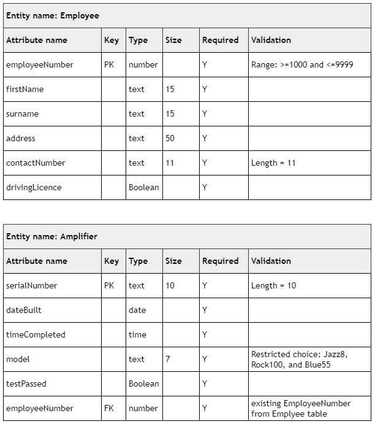

# N5 CS Specimen Task 1B

## Data dictionary

## Tasks

___1d___ The personal details of a new employee are listed below.

* Employee number: 1599
* Name: Jeremy May
* Address: 67 Red Lane
* Driving licence: True
* Contact telephone number: 07923782534

Implement the SQL statement that will add this new record to the correct table. (__2 marks__)

Print evidence of both the implemented SQL statement and the Employee table (clearly showing the new record).